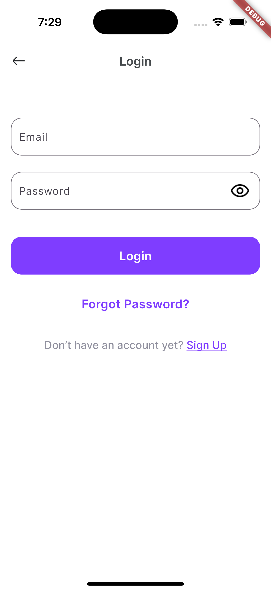
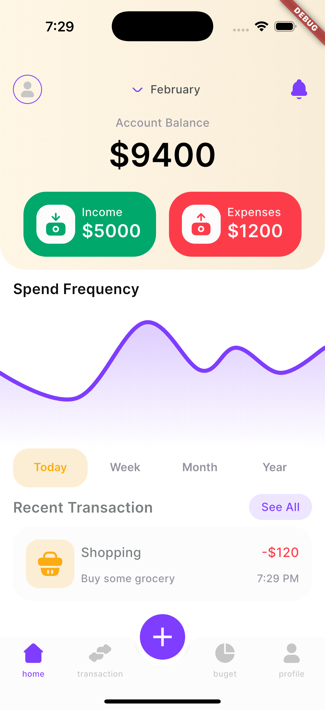

# Montra Expense Tracker

🚀 **Montra Expense Tracker** 是一個簡潔美觀的記帳應用，幫助使用者輕鬆管理每日開支。此專案使用 **Flutter** 開發，並結合優雅的 UI 設計，提升使用體驗。

## 🖼️ 預覽

## 🎨 設計來源

特別感謝 [UI Store Design](https://www.uistore.design/items/montra-expense-tracker-free-ui-kit-for-figma/) 提供的 **Montra Expense Tracker - Free UI Kit**，讓本專案能夠擁有出色的使用者介面。

## 🔧 技術棧
- **Flutter** - 構建跨平台應用

